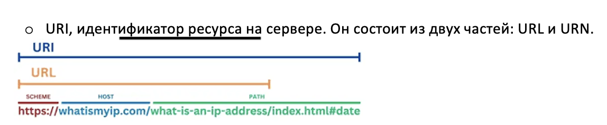

# qaguru-api-tests-37-IL
## Запуск домашки #13:
```bash
./gradlew clean homework-13
```

## RestAssured
```java
given()
  .log().uri()
.when()
  .get("https://selenoid.autotests.cloud/status")
.then()
  .log().status()
  .log().body()
  .statusCode(200)
  .body("total", is(5))
  .body("browsers.chrome", hasKey("100.0"))
  .body("browsers.firefox", hasKey("97.0"));
```
Базовые параметры библиотеки
- `given()` - Request Specification - Что передаем в запрос
- `.when()` - С каким методом и какую ручку дергаем
- `.then()` - Validatable Response - Проверки ответа  

Логирование
- `.log().all()` - логируем всё
- `.log().uri()` - логируем uri
- `.log().status()` - логируем статус ответа
- `.log().body()` - логируем тело ответа  

```json
{
    "total": 5,
    "browsers": {
        "chrome": {
            "127.0": {},
            "128.0": {}
        }
    }
}
```

Проверки
- `.body("total", is(5))` - параметр тела ответа "total" равен 5 (библиотека `org.hamcrest.Matchers`)
- `.body("browsers.chrome", hasKey("128.0"))` - в массиве "chrome" массива "browsers" есть параметр "128.0"



# Урок 14: REST API. Модели. Спецификации.
1. Убираем тело запроса и ответ в модели
2. Добавляем спецификации
3. Добавляем Allure-отчетность
   3.1 Добавляем шаблоны для более красивого отчета
4. Задание: Доработать автотесты на reqres.in с моделями (lombok), спецификациями, allure (со степами) и сборкой в Jenkins.

## Подключение кастомного отчета allure
1. В helpers создать класс `CustomAllureListener`
```java
public class CustomAllureListener {
   private static final AllureRestAssured FILTER = new AllureRestAssured();

   public static AllureRestAssured withCustomTemplates() {
      FILTER.setRequestTemplate("request.ftl");
      FILTER.setResponseTemplate("response.ftl");
      return FILTER;
   }
}
```
2. Закинуть в `src/test/resources/tpl` файлы `request.ftl` и `response.ftl`
